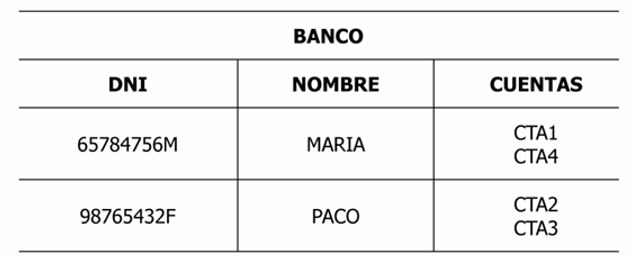
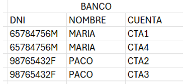
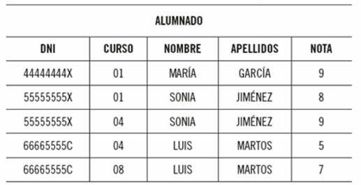
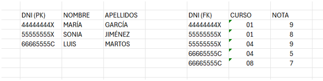
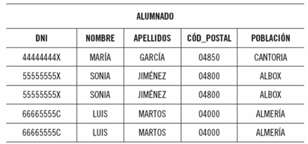
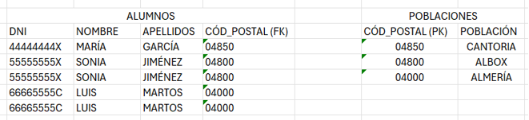
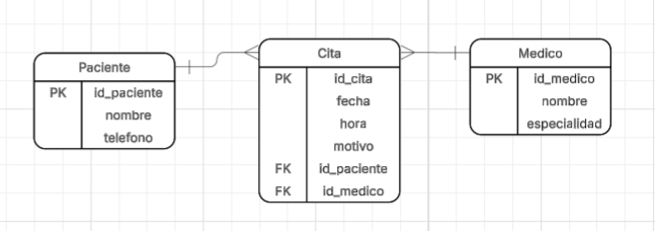

  
  
  # BASES DE DATOS II
  ## TALLER N°1
  
  **ESTUDIANTE:** EURIS RODRIGUEZ 8-1013-2315

---

## 📋 **Problema #1: Identificación del tipo de cardinalidad**

Una universidad maneja la siguiente información:
- Un estudiante puede estar inscrito en varias materias.
- Una materia puede tener muchos estudiantes inscritos.

### **📝 Preguntas:**

1. **¿Qué tipo de relación existe entre Estudiante y Materia?**  
   **Respuesta:** Existe una relación de muchos a muchos N:M.

2. **¿Cuál es la cardinalidad de esta relación?**  
   **Respuesta:** N:M (Muchos a muchos).

3. **¿Por qué no sería correcto modelar como 1:1 o 1:N?**  
   **Respuesta:** Porque según el enunciado un estudiante puede estar inscrito en muchas materias y una materia puede tener muchos estudiantes. La relación 1:1 implicaría que un estudiante solo puede tener una materia y una materia solo puede tener un estudiante, lo que contradice el escenario planteado. En cuanto a 1:N, también sería incorrecto porque limitaría a que muchas materias solo puedan tener un estudiante inscrito, cuando deberían poder tener múltiples estudiantes.

4. **Dibuja cómo se vería la cardinalidad usando una de las simbologías explicadas en clase.**

  
   
  <em>Figura 1: Relación N:M entre Estudiante y Materia</em>

---

## 📋 **Problema #2: Cardinalidad aplicada en el modelo entidad-relación**

Con base en el siguiente escenario:
- Un cliente puede realizar muchos pedidos.
- Cada pedido pertenece a un solo cliente.
- Un pedido no puede existir sin un cliente.

### **📝 Preguntas:**

1. **Indica la cardinalidad entre Cliente y Pedido.**  
   **Respuesta:** Uno a muchos 1:N

2. **Especifica si la participación del Pedido es total u opcional.**  
   **Respuesta:** Un pedido no puede existir sin un cliente, por lo tanto la participación es **total**.

3. **Dibuja cómo se vería la cardinalidad usando una de las simbologías explicadas en clase.**

  
   
  <em>Figura 2: Relación 1:N entre Cliente y Pedido</em>

---

### **🔍 Indique cuáles son los tipos de cardinalidad:**
a. Relación 1-1.  
b. Relación 0-0.  
c. Relación R-r.  
d. Relación 1-N.  
e. Relación N-M.  

**NOTA:** Selección múltiple

---

## 📊 **II PARTE - Normalización - 30 puntos**

Basándonos en los siguientes enunciados, aplique el concepto de normalización:

### **1. Desea realizar la normalización N1 o primera forma normal (FN) de la siguiente tabla.**

  

**¿Cómo lo haría?**

  
   
  <em>Figura 3: Solución de la primera forma normal</em>

**Respuesta:** Según la norma 1FN, cada celda debe tener un solo valor y no deben existir grupos repetitivos. En este caso, la columna "cuentas" contiene múltiples valores. Para normalizar, se descompone la tabla creando filas adicionales para cada cuenta, duplicando el DNI para que la clave primaria sea la combinación de DNI y cuenta.

---

### **2. Desea realizar la normalización 2FN o segunda forma normal de la siguiente tabla.**

  

  
   
  <em>Figura 4: Solución de la segunda forma normal</em>

---

### **3. ¿Cuál sería la diferencia entre la 1FN y la 2FN?**

**Respuesta:** La 1FN se enfoca en que cada celda contenga un solo valor atómico y elimina los grupos repetitivos. La 2FN va más allá, separando los datos que no dependen completamente de la clave primaria en tablas independientes. Mientras la 1FN garantiza atomicidad, la 2FN elimina dependencias parciales, organizando los datos por categorías para evitar redundancias.

---

### **4. Desea realizar la normalización 3FN o tercera forma normal de la siguiente tabla.**

  

  
   
  <em>Figura 5: Solución de la tercera forma normal</em>

---

### **5. Si analizando un caso práctico se encontrara en el paso de la 2ª FN, ¿qué debería comprobar usted para seguir normalizando hasta la 3ª FN?**

**Respuesta:** Para avanzar de la 2FN a la 3FN, debo verificar si existen dependencias transitivas, es decir, si algún atributo no clave depende de otro atributo no clave. Por ejemplo, si tengo una tabla con "DepartamentoID" y "NombreDepartamento", donde el nombre depende directamente del ID del departamento y no de la clave primaria de la tabla, entonces debo separar estos atributos en una tabla independiente. La 3FN elimina estas dependencias transitivas creando tablas separadas para los datos relacionados.

---

## 🔗 **III PARTE - Diagrama entidad-relación - 50 puntos**

### **📂 Parte A**

#### **1. Diseño de relación Cliente-Cuentas Bancarias**

**¿Cómo plantearía el análisis de poder realizar un diagrama entidad-relación?**

**Respuesta:** 
1. **Identificación de entidades:** Cliente y Cuenta Bancaria.
2. **Atributos:** 
   - Cliente: cédula, nombre, apellidos
   - Cuenta: código único, número de cuenta, saldo
3. **Relación:** Un cliente puede tener varias cuentas, pero cada cuenta pertenece a un solo cliente → relación 1:N.
4. **Implementación:** Usar la cédula del cliente como clave foránea en la tabla Cuentas.
5. **Diagrama:** Dos entidades conectadas con una relación 1:N.

#### **2. Sistema de Gestión de Inversiones**

**¿Qué entidades encuentra y de qué tipo?**

**Respuesta:** 
- **Acción:** Entidad fuerte con atributos: nombre empresa, NIF, siglas, domicilio.
- **Cliente:** Entidad fuerte (atributos no especificados pero implícitos).
- **Orden:** Entidad fuerte que registra operaciones de compra/venta.
- **Cotización:** Podría ser una entidad débil dependiente de Acción o una entidad relacionada, con atributos: fecha, hora, valor.

Todas son entidades fuertes con identificadores únicos, aunque Cotización podría modelarse como atributo multivaluado o entidad separada dependiendo del diseño.

---

### **📂 Parte B**

**Pasos para diagramas ER:**
1. Seleccionar entidades, tipología y atributos (incluyendo claves primarias)
2. Conectar entidades mediante relaciones representadas con rombos
3. Especificar cardinalidad para cada relación
4. Buscar la solución más eficiente

---

## 🏥 **Problema #3: Sistema de gestión de citas médicas**

**Detalle:**
- Un paciente puede tener muchas citas.
- Un médico puede atender muchas citas.
- Cada cita corresponde a un solo paciente y un solo médico.
- Una cita tiene: fecha, hora y motivo.
- Un médico puede existir en el sistema aunque aún no tenga citas asignadas.

### **📝 Solución:**

1. **Identificar las entidades principales.**  
   **Respuesta:** Paciente, Médico y Cita.

2. **Determinar las relaciones entre ellas.**  
   **Respuesta:** Paciente agenda Cita, Médico atiende Cita.

3. **Definir la cardinalidad y la participación.**  
   **Respuesta:** 
   - Paciente-Cita: (1, N) - participación parcial (paciente puede no tener citas)
   - Médico-Cita: (1, N) - participación parcial (médico puede no tener citas)
   - Cita-Paciente: (1, 1) - participación total
   - Cita-Médico: (1, 1) - participación total

4. **Diagrama entidad-relación:**

  
   
  <em>Figura 6: Diagrama ER para sistema de citas médicas</em>

---

## 🛒 **Problema #4: Sistema de ventas de una tienda en línea**

**Detalle:**
- Un cliente puede realizar muchas ventas.
- Cada venta pertenece a un solo cliente.
- Una venta puede incluir varios productos.
- Un producto puede aparecer en muchas ventas.
- De cada producto vendido se debe registrar la cantidad y el precio de venta.
- Un producto puede existir aunque aún no se haya vendido.

### **📝 Solución:**

1. **Identificar todas las entidades involucradas.**  
   **Respuesta:** Cliente, Producto, Venta, DetalleVenta.

2. **Detectar relaciones y cardinalidades.**  
   **Respuesta:** 
   - Cliente-Venta: 1:N
   - Venta-Producto: N:M (resuelta mediante DetalleVenta)

3. **Resolver la relación N:M entre Venta y Producto.**  
   **Respuesta:** Se crea la entidad intermedia DetalleVenta con atributos: cantidad, precio unitario.

4. **Modelar correctamente los atributos dependientes de la relación.**  
   **Respuesta:** Cantidad y precio de venta son atributos de la relación (DetalleVenta), no de Producto ni Venta individualmente.

---

  <strong>🎯 FIN DEL TALLER</strong>

